# 窗 · Chuang

**把你头顶此刻真实的天空，搬到桌面的一扇窗里。**

*A live window to the real sky above you — sun, moon, stars, weather and the shadow on the windowsill, all correct.*

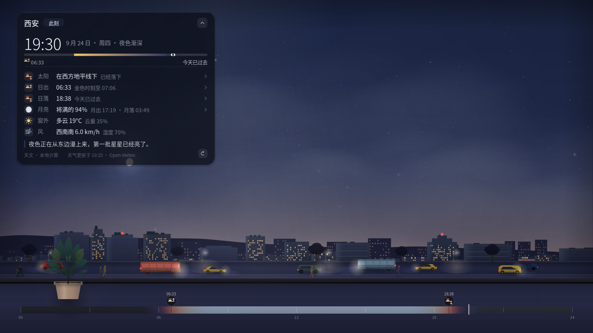


---

## 这是什么

它不是天气预报，也不是星象软件，而是**桌面上的一扇窗**：打开就对了，没有账号、
没有向导、没有需要你操心的地方。

- 太阳、月亮（连相位与亮面朝向）、一千六百多颗星星，全部由**本地天文算法**算出，
  断网也完全正确；
- 有网络时**镜像真实天气**：外面下雨，窗上就下雨；外面阴天，太阳只剩一个隐约的亮斑；
  起雾时远处的屋顶真的会糊掉；
- **影子是会跟着太阳动的**：窗台上的盆栽、街上的行人和车、道路连同城市天际线，
  受光面与影子的方向和长短都由真实的太阳方位角与高度角决定——早晨影子长、
  正午最短、太阳偏左影子就往右倒，阴天下雨起雾时影子跟着淡掉、直到没有。

它适合被"不时瞄一眼"：在无窗的房间待久了、想出门拍照、深夜加班想知道外面下没下雨。

## 亮点

| | |
|---|---|
| **今日天色** | 窗底那条细长光带是今天 00:00–24:00 天色的连续变化。**可以用鼠标拖动它"时间旅行"**，预览今晚 21:00 天是什么颜色——太阳高度、剩余天光、月相、云的多少都会跟着那一刻变。|
| **此刻的事实** | 左上角那张卡（空格收起/展开）：大字时刻、日出到日落的「日弧」、太阳方位与高度、金色时刻、月相月出月落、此刻天气，外加一句人话。每一行都配了一枚手画的矢量图标，**而且可以点**：点日出/日落/月亮就跳到那一刻去看，点「窗外/风」摊开完整天气（体感、阵风、能见度、数据来源与更新时间），右下角刷新立刻重问一次真实天气（成功还是失败都会回一句话）。底下那行会写清楚**这份天气是什么时候问回来的**。|
| **看着顺** | 画面由帧时钟驱动，默认 60 帧/秒（以前固定 10-14 帧，窗口没有焦点时只有 2-3 帧）。菜单 → 看 → **画面流畅度** 可以按机器挑 24 / 30 / 45 / 60 / 120。|
| **街上有人** | 地平线下那条街上有行人、自行车、轿车、SUV、厢式车、出租车与公交车，路边还有一排行道树。人是用腿走的（有膝盖、有摆臂，雨天撑伞，还有牵狗的人）；车轮压在车身的轮拱里，白天车窗映天、夜里车灯在地上洒一片光。**路上有几辆车、几个人跟着时刻、星期与天气走**：工作日早晚高峰最热闹，周末晚一点也平一点，凌晨三点街上几乎是空的，下雨行人明显变少、骑车的人几乎没有。他们的位置是**时间的函数**，所以连续移动，同一时刻永远画成同一个样子。|
| **会投下影子的城市** | 天际线按城市名生成三层：远山、被空气洗淡的远景楼群、近景建筑（塔楼／写字楼／住宅／坡屋顶小楼／店面／厂房，带水箱、天线、烟囱、阳台）。楼有自己的颜色而不是纯黑剪影，太阳偏哪边就亮哪边的立面、影子就往另一边倒，太阳落下就退回剪影；楼与楼之间还会互相遮挡。|
| **一扇能挂起来的窗** | 可以设为桌面壁纸，也可以缩窄后置顶在屏幕角落当"桌面夜灯"。|
| **收进托盘** | 关窗时问一次"最小化到托盘还是退出"并记住；托盘菜单与应用菜单**同源**，勾选状态天然一致。|

## 截图

| 清晨 · 金色时刻 | 上午 · 大致晴朗 | 正午 · 多云 |
|---|---|---|
| 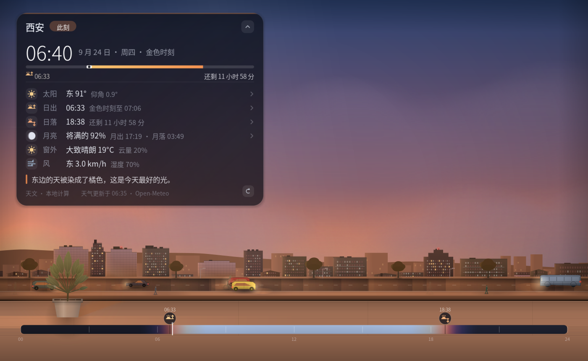 | 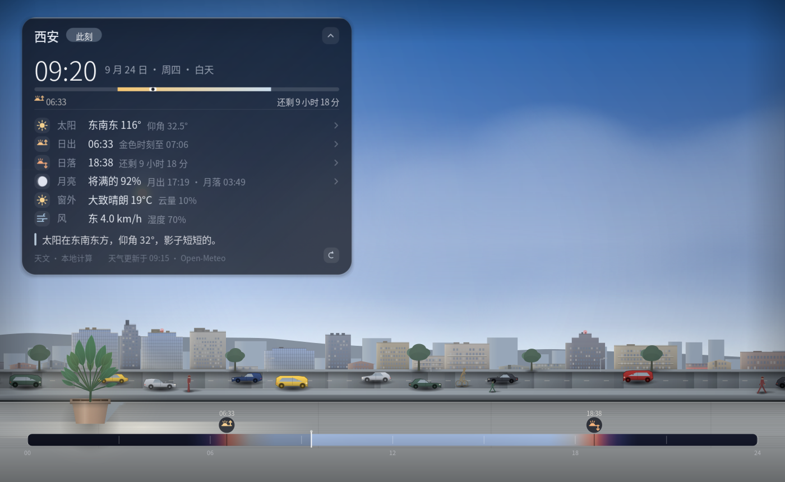 | 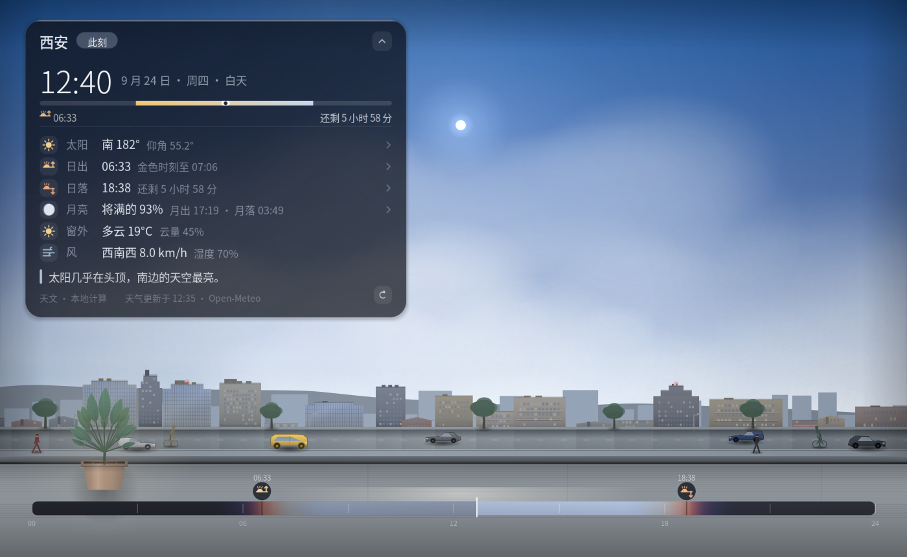 |

| 傍晚 · 金色时刻 | 暮色 · 下雨 | 夜 · 雨中车灯 |
|---|---|---|
| 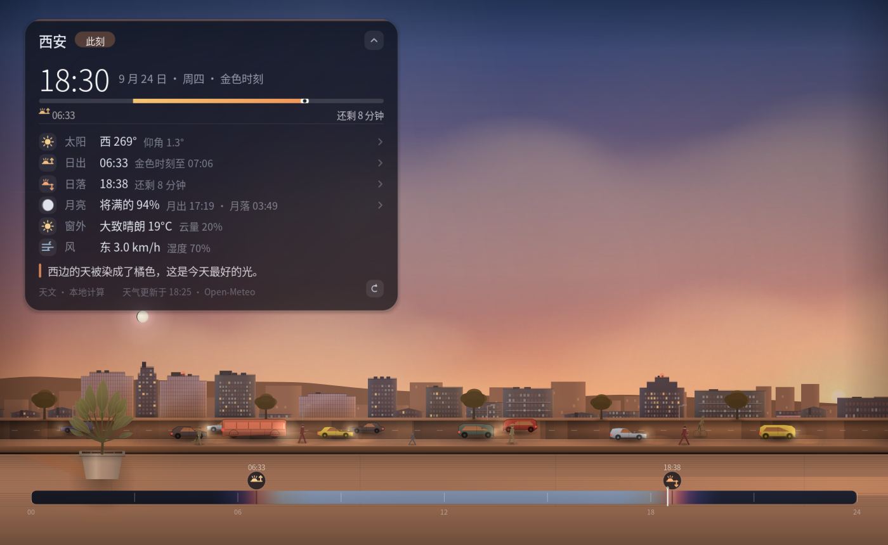 | 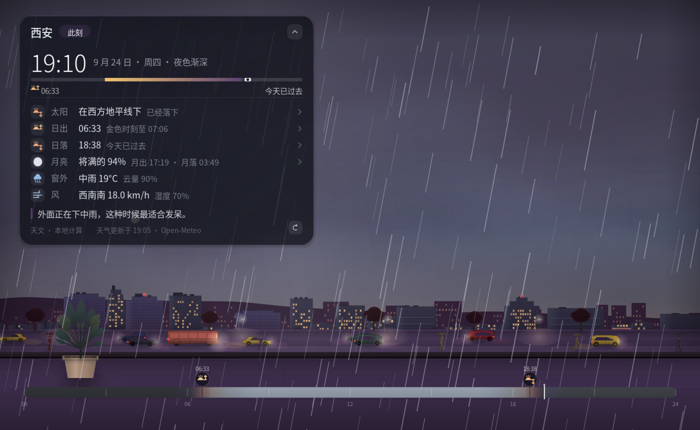 | 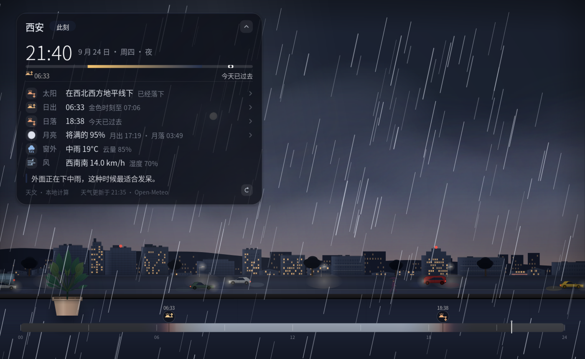 |

| 阴天 | 雪 | 雾 |
|---|---|---|
| 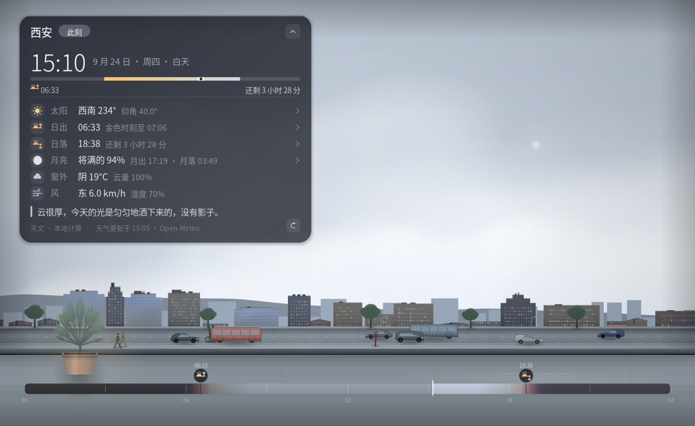 | 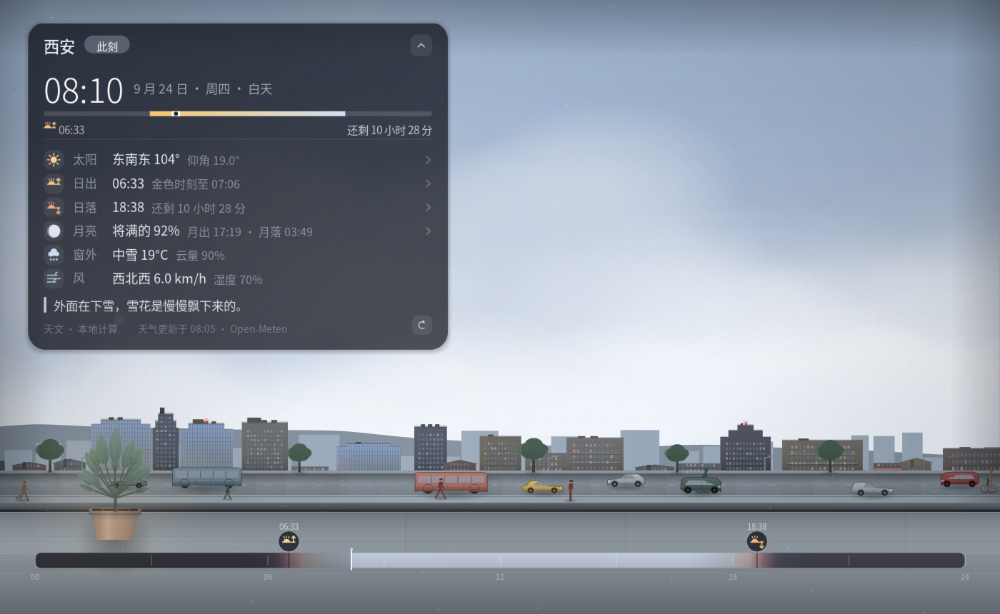 | 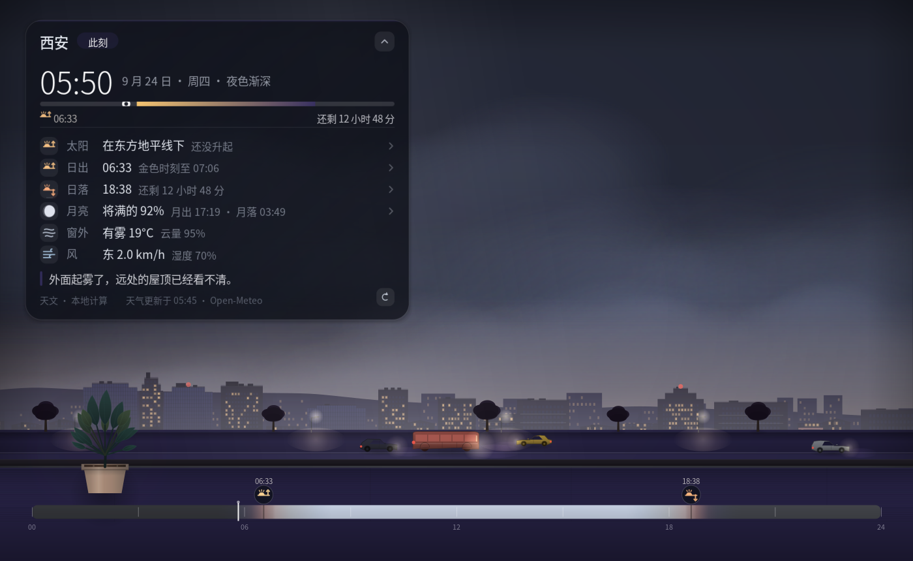 |

| 宽幅：一扇横窗 | 作为桌面壁纸 |
|---|---|
| 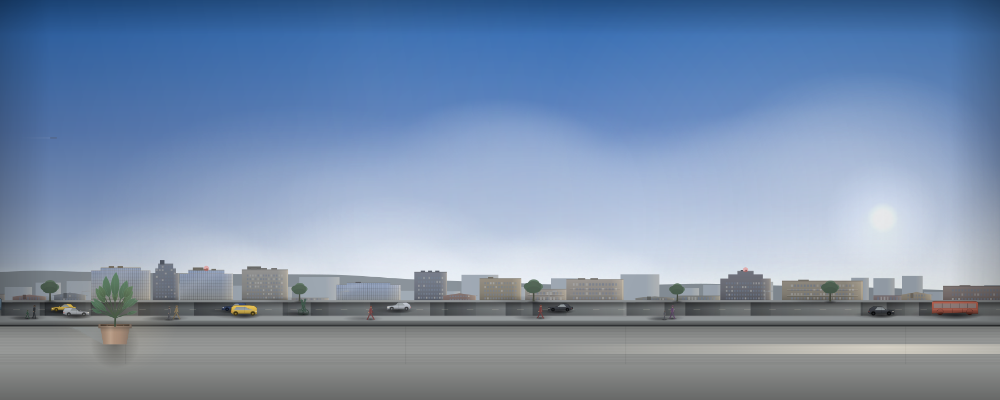 |  |

> 截图由程序自己的渲染器离屏生成，可一键重跑：`python3 tools/make_screenshots.py`

## 安装

### 方式一：`.deb` 一键安装（推荐）

从 [Releases](../../releases) 下载最新的 `.deb`（例如 `chuang_1.1.7_all.deb`）：

```bash
sudo dpkg -i chuang_*_all.deb
sudo apt-get -f install      # 万一缺依赖，补一下
```

装完在应用菜单里搜「窗」，或终端输入 `chuang`。卸载：`sudo apt remove chuang`。

> 这些包由 CI 自动打、自动挂：版本号一涨，`.deb` 与 `SHA256SUMS` 就随 Release 一起发出。

### 方式二：从源码安装

```bash
git clone https://github.com/lsqkk/Chuang.git && cd Chuang
./install.sh                 # 需要时用 sudo
```

它会装到 `/opt/chuang`，并在 `/usr/local/bin/chuang` 放一个命令、注册菜单项与图标。
卸载：

```bash
sudo rm -rf /opt/chuang /usr/local/bin/chuang \
  /usr/share/applications/chuang.desktop \
  /usr/share/icons/hicolor/scalable/apps/chuang.svg
```

### 依赖

只用系统自带的组件，**没有第三方 Python 库**：

```
python3-gi  python3-gi-cairo  python3-cairo  gir1.2-gtk-4.0  gir1.2-adw-1
可选：python3-xlib（用于"窗口置顶"）
```

## 使用

| 操作 | 效果 |
|---|---|
| 拖动底部「今日天色」长卷 | 时间旅行，预览任意时刻的天空 |
| 点顶部提示条 / 按 `Esc` | 回到此刻 |
| 光标在长卷上滚滚轮 | 前后微调 10 分钟 |
| 菜单 → 看 → **跳到某天某时…** | 用日历 + 时/分选框直接跳到任意一天任意一刻 |
| 点信息卡上的 `日出 / 日落 / 月亮 / 太阳` | 跳到那一刻去看看（按 `Esc` 回到此刻）|
| 点信息卡上的 `窗外 / 风` | 摊开完整的一份天气：体感、阵风、能见度、数据来源与更新时间 |
| 点信息卡右上角的箭头（或按 `C`） | 把卡片收成一条，只留时间与那句话（壁纸上的那张可以单独设成"跟随窗口 / 精简 / 完整"）|
| 点信息卡右下角的刷新（或按 `R`） | 立刻重问一次真实天气，问完会说明结果与更新时间 |
| 日弧上悬停 / 点一下 | 看那一刻是几点，点一下跳过去 |
| `空格` | 显示 / 隐藏「此刻的事实」 |
| `C` / `R` | 收起信息卡 / 立刻刷新天气 |
| `F11` | 沉浸全屏 |
| 菜单 → 看 → **画面流畅度** | 24 / 30 / 45 / 60（默认）/ 120 帧每秒；窗口没拿到焦点时按最多 30 帧省电 |
| 右上角图钉 | 窗口置顶（缩窄后放在角落当"电子窗景"）|
| 右上角菜单 | 顶层只有 6 行：换一扇窗 / 跟随真实天气 / 沉浸全屏、**桌面壁纸 ▸**、**看 ▸**、**开机与关窗 ▸**、**关于与帮助 ▸**、退出。不常用的开关都收进了对应的子菜单，托盘里的菜单一模一样 |

### 放到桌面上

> 先说清楚：**GNOME 没有"动画壁纸"的接口**。壁纸永远是一张静态图，系统只在换图时重画一次。
> 想让它动，只有两条路：不断换图（第 1 种），或者用一个铺满桌面的窗口自己画——
> 后者会把**桌面图标和右键菜单盖住**（GNOME 的桌面图标画在系统图层里，客户端窗口一定压不过它），
> 所以「窗」**不做**那种方案。

1. **壁纸跟随此刻（默认每 10 秒换一张，可选 30 秒 / 1 分钟）** — 时间、天色、街上的人车都跟着走。
   程序**就地重写桌面正在显示的那张图**：gnome-shell 对它有文件监听，内容一变就丢掉
   解码缓存重读，画面立刻换成新的。（换文件名反而会让它拿出"这个文件上一次解码的结果"，
   于是桌面上会闪过旧画面——这是 1.1.4 修掉的老问题，细节见 `DESIGN.md`。）
   **需要「窗」留在托盘里**：菜单 → 关窗时：最小化到托盘。
  代价：留一颗核约 6% 用于绘制（一帧的耗时见下面的表）。稳态下
  **不写任何系统设置**：只有"接管桌面"和每几分钟一次的兜底才真的换一次文件名、
  写一次 `gsettings`。
   同一时刻只允许一个「窗」在更新壁纸；第二次启动只会把已有的那扇窗叫到前面。
2. **离线动态壁纸（关掉程序也有效）** — 把今天 24 小时画成 96 张天色
   （每 15 分钟一张，用当天逐时预报算云量），写成 GNOME 原生的 `<background>` 定时壁纸。
   不用开着程序，桌面也会从清晨走到夜里；代价是粒度粗，看着是"天色在变"而不是连续动画。
3. **单张快照** — 把此刻的天空设为壁纸，之后不再变化。

两种都可以配合 **壁纸上显示「此刻的事实」** 与 **「今日天色」长卷** 两个开关；
那张卡在壁纸上有自己的版式（**壁纸上信息卡的版式**：跟窗口一致 / 精简一条 / 完整版），
窗口里收成了小条，桌面上也可以照样跟着收（默认就是跟随）。
第一次改壁纸前会记下原来那张，菜单里的**还原成原来的壁纸**随时能换回去。

## 开机自启

菜单 → **开机与关窗 ▸** → 打开「开机时自动打开」即可（写在
`~/.config/autostart/chuang.desktop`）。只想让壁纸跟着走、不想每次看见窗户，
再用「开机时直接进托盘（不弹窗）」。

这条自启项里是**绝对路径**：换了安装方式（源码安装 ↔ `.deb`）之后它会指向一条
已经不存在的命令，而 GNOME 只是**静默**忽略整条自启项（不会有任何提示，只在日志里
留一句 `Exec binary ... does not exist`）。所以「窗」每次启动都会核对并就地修好它，
不需要你手动改。命令行里也可以直接启动：`chuang --hidden`（不弹窗，直接进托盘）。

## 常见问题

**为什么壁纸里的行人是一跳一跳的，而应用窗口里是连续走的？**
因为壁纸是一张静态图，只能靠"换图"制造变化。应用窗口是连续绘制的
（默认 60 帧/秒，菜单 → 看 → 画面流畅度 可调），所以那里的人车走得顺滑；
壁纸每 10 秒换一张，人车看上去就是一秒一步地"顿"过去。

**拖到别的时刻预览时，为什么人车还在走？**
天色和影子会停在预览的那一刻（那是你要看的东西），但街上的人车、天上的云按"预览
开始之后真正过去的时间"继续走——不然画面会像一张照片。想精确跳到某天某时，用
菜单里的 **看 → 跳到某天某时…**。

**壁纸刷新了，桌面上的时间却没变？**
三种情况的措辞不一样，可以这样分辨：

- **桌面显示的是"这个文件上一版"**（内容确实变了，但画面上是几轮之前的）：
  gnome-shell 按文件缓存解码结果，而且只监听"当前显示的那个文件"。1.1.4 起改为
  **就地重写正在显示的那张**，这一类问题不会再出现。
- **换图完全没生效**（`gsettings` 写进去了、深色模式真正生效的 `picture-uri-dark` 没变）：
  现在每次换图都会回读校验，另有每 5 秒一次的兜底。
- **时间彻底不走**：多半是心跳停了（定时器被异常打死），1.1.3 起已经包了 try。

三种都能用菜单里的 **桌面壁纸 → 壁纸诊断…** 当场分辨（那份报告可以整段复制）。

**托盘图标不见了？**
「窗」的托盘依赖 GNOME 的 AppIndicator 扩展（Ubuntu 默认开启）。如果扩展曾被别的程序
弄崩而被禁用，需要重启一次 GNOME Shell：按 `Alt+F2`，输入 `r`，回车。
（程序内部有自动重试：扩展恢复后它会自己重新注册，不必重启「窗」。）

**没网会怎样？**
完全可用。天空、日月星、影子全部本地计算，只是不知道有没有云；信息卡会显示
「未联网 · 仅天文模式」，有历史缓存时会继续显示上次的天气并标注。

**它会不会很吃资源？**
窗口可见时按你选的帧率画：默认 **60 帧/秒**大约吃半颗核（960×620 的窗口），
窗口没拿到焦点时自动降到最多 30 帧（约四分之一颗核），收进托盘后完全不绘制。
嫌吵就在菜单 → 看 → **画面流畅度** 里降到 24 或 30 —— 帧率的开销是线性的。
壁纸跟随模式额外约 6%（每 10 秒一次，在后台线程里做）。下面的数字都按**每帧**
算，缓存已预热（含信息卡与长卷）——耗时跟窗口大小直接相关，所以标上尺寸
（本机实测，取多次运行的中位数；乘以帧率就是 CPU 占用，
60 帧 × 10 ms ≈ 三分之二颗核）：

| 尺寸 | 晴天 | 中雨 |
|---|---|---|
| 960×620（默认窗口） | 约 10 ms | 约 11 ms |
| 1920×1080（全屏 / 壁纸） | 约 21 ms | 约 24 ms |

冷启动的第一帧（切城市、切天气时各一次）约 40～115 ms，会有一次肉眼可见的顿挫。
**多显示器**按主屏的比例作画：GNOME 给每块屏幕用的是同一张图（zoom 裁切），
所以别的屏幕会按自己的比例裁一下，不会跨屏拼成一张大图。

**城市怎么换？**
菜单 → 换一扇窗（城市），联网搜索即可；也可以直接填经纬度——时区会联网问一次
（IANA 时区，夏令时跟着对），断网时才退回"按经度取整"并提示可能差一小时。

## 检查更新

菜单底部有 **检查更新** 与 **自动检查更新**（默认开启，一天最多问一次）。
它只做一件事：向 GitHub Releases 接口问一句"最新版本号是多少"——
不发送任何身份信息，也不会上传任何数据，随时可以关掉。

发现新版本时，菜单最上方会出现入口：

- **下载并安装 vX.Y.Z** —— 程序自己把 `.deb` 下好，然后开一个终端跑
  `sudo apt-get install`。你在终端里输一次密码就装完了，过程与报错都看得见；
  装好后它会问「现在重启吗」，选「现在重启」会先等旧进程退出再拉起新版本。
  **装之前会先核对**：拿 Release 上的 `SHA256SUMS` 算一遍摘要，对不上就不装
  （两个摘要都摆出来给你看）；发布里没有校验文件时也不自动装，
  只把包留在下载目录里，让你自己决定要不要手动装。
- **只下载 .deb 安装包** —— 下到「下载」目录，并给你一条可复制的手动安装命令。
- **打开发布页** / **跳过这个版本**。

带路径、命令或报错的提示，末尾会多一个「详情」：点一下弹出可选中、可一键复制的窗口。
「关于窗」里也会标出新版本号。命令行同样可用：

```bash
chuang --version          # 打印版本
chuang --check-update     # 检查更新；有新版本时退出码为 10
```

网络不通时它会静默降级：自动检查不打扰你，手动检查会明确说"检查更新失败"。

## 反馈与作者

菜单 → **关于与帮助 ▸** 里有：

- **问题反馈 / 提个建议（GitHub）** —— 直接打开仓库的"新建 issue"页，并预填好
  版本号、GTK / libadwaita 版本、会话与桌面环境、托盘与壁纸状态。
  预填的内容**不含位置、不含任何个人信息**，打开后你随时可以删。
- **作者的主页（GitHub）** —— [github.com/lsqkk](https://github.com/lsqkk)（蓝色奇夸克）。
- **关于窗** —— 版本号、有新版本时的提示，以及作者链接。

## 数据与隐私

- 天空：**本地计算**，不出网。
- 天气：只把经纬度发给 [Open-Meteo](https://open-meteo.com/)（免费、无需 API Key），
  结果缓存在 `~/.cache/chuang/weather.json`；断网自动退回"纯天文模式"。
- 位置：存在 `~/.config/chuang/config.json`，仅本机。
- 检查更新：向 `api.github.com` 询问最新版本号（一天一次，可关闭），不带任何标识。
- 没有账号、没有统计、没有任何上传。

## 开发

```bash
./chuang-gui                       # 直接跑（开发模式）
./chuang-gui --city                # 启动时直接打开"换一扇窗"
./chuang-gui --hidden              # 不弹窗，直接进托盘（开机自启用的就是它）
CHUANG_TIME=21:30 ./chuang-gui     # 把"此刻"假装成 21:30
CHUANG_WEATHER=63:95:18:200 ./chuang-gui   # 假装成 中雨/云量 95%/风 18km-h/200°
python3 tools/make_screenshots.py  # 重新生成 README 里的截图
python3 tools/snapshot.py a.png 18:35 34.34 108.94     # 不开窗口直接出一张图
./packaging/build-deb.sh           # 打 .deb（产物在 packaging/out/，不进仓库）
make help                          # 常用任务
```

代码分层（`chuang/`）：

| 文件 | 职责 |
|---|---|
| `astronomy.py` | 本地天文：太阳（NOAA）、月亮（Meeus 第 47 章）、恒星、升落与暮光 |
| `palette.py` | 以太阳高度角为唯一驱动量的天色色板（线性光空间插值） |
| `scene.py` | 把「时刻＋地点＋天气」组装成一帧，并生成今日天色长卷 |
| `weather.py` | Open-Meteo 客户端、缓存与离线降级 |
| `render.py` | 全部 Cairo 绘制：天空、云雨、地面与窗台、长卷、信息卡 |
| `city.py` | 远山／远景楼群／近景建筑：形状按城市种子生成，颜色与影子由太阳方位角与高度角算出 |
| `street.py` | 行人与车辆（位置是时间的函数，因此在动态壁纸里也连贯） |
| `tray.py` | 系统托盘（KStatusNotifierItem + DBusMenu，纯 Gio 实现） |
| `wallpaper.py` | 壁纸渲染线程、GNOME 动态壁纸 XML、设置与还原 |
| `wallpaper_ctl.py` | 「放到桌面上」这一摊：接管、跟随、动态壁纸、还原、诊断 |
| `update.py` / `update_ui.py` | 检查更新（纯标准库）／下载、校验、安装、重启的界面 |
| `actions.py` | 菜单长什么样、每个入口接到哪个动作——只有这一处定义 |
| `dialogs.py` | 自己搭的几个小窗口（换城市、跳到某一刻、诊断详情…） |
| `diagnostics.py` | 给 issue 用的环境信息与「壁纸诊断」文本（纯函数，好测） |
| `infocard.py` | 「此刻的事实」上的交互：命中、点开跳过去看、摊开完整天气 |
| `keys.py` | 键盘（空格 / C / R / 左右 / Home / Esc）与"焦点要留在画面上" |
| `frames.py` | 帧率：谁来驱动重绘（帧时钟）、菜单里那几档怎么调 |
| `app.py` | 窗口本身：画面、交互、心跳、托盘与生命周期 |

改代码时有两个顺手的诊断口子：环境变量 `CHUANG_TIME`（假装时刻）与 `CHUANG_WEATHER`
（假装天气），以及 `tools/snapshot.py`——不用开窗口就能把任意天气任意时刻画成 PNG。
更多约定见 [CONTRIBUTING.md](CONTRIBUTING.md)。

## 致谢

- 天气数据：[Open-Meteo](https://open-meteo.com/)，免费且无需 API Key。
- 星表：由 [d3-celestial](https://github.com/ofrohn/d3-celestial) 的星表裁剪而来
  （星等 ≤ 5.0，约 1600 颗），构建脚本见 `tools/build_stars.py`。
- 太阳位置采用 NOAA Solar Calculator 的算法；月亮位置采用 Jean Meeus
  《Astronomical Algorithms》第 47 章（表 47.A / 47.B 各 60 项），并把月亮的
  地心坐标换算成**地面观测者**看到的位置（地平视差最大 61′）。
  升落与中天的时刻和**美国海军天文台（USNO）**的官方数据对照过：
  四城 × 三季 × 五个时刻，全部相差 0.5 分钟以内（见 `tests/test_astronomy.py`）。

## 许可

[MIT](LICENSE)
