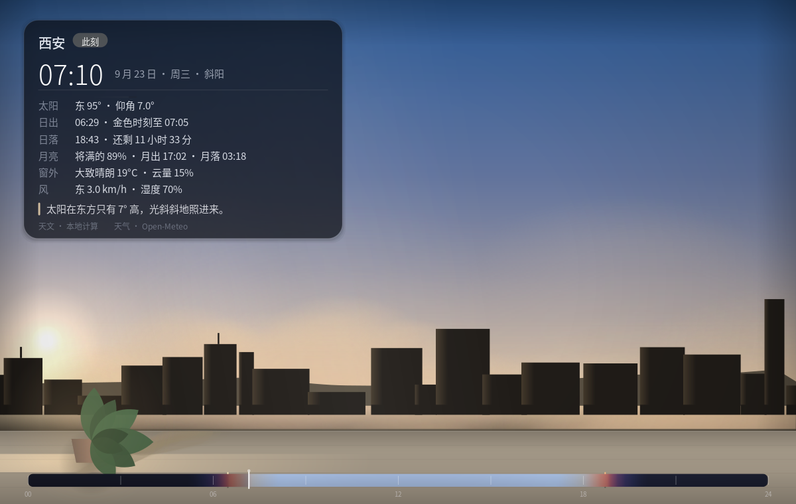
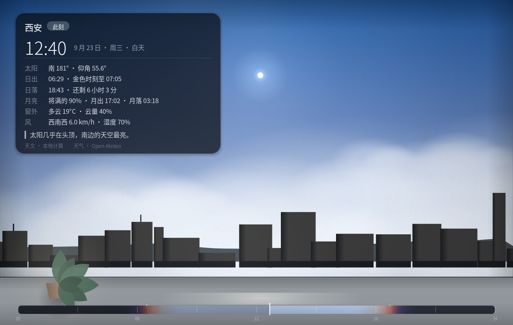
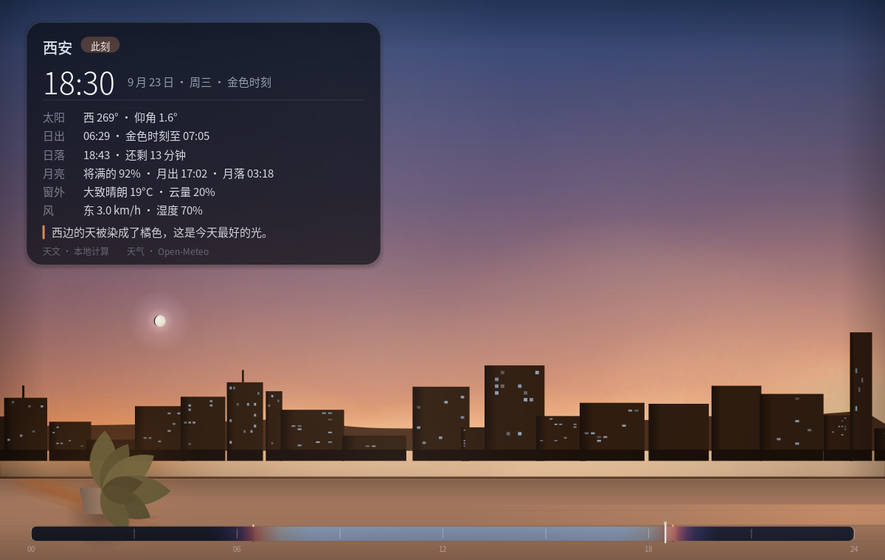
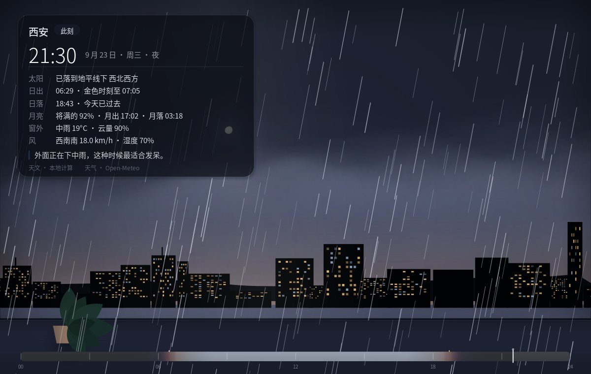

# 窗 · Chuang

> 把你头顶此刻真实的天空，搬到桌面的一扇窗里。

| 清晨 | 白昼多云 | 金色时刻 | 雨夜 |
|---|---|---|---|
|  |  |  |  |

它不是一个用完就关的工具，而是一个会一直变化的小物件：

- **真实的天**：太阳、月亮（连相位和亮面朝向）、一千多颗亮星、完整的暮光分级，
  全部由本地天文算法算出，断网也完全正确。
- **真实的天气**：有网络时，云量、云型、雨、雪、雷、雾都会真实地发生在你的窗上——
  外面下雨，窗上就下雨；外面阴天，今天的太阳就只剩一个隐约的亮斑。
- **真实的影子**：窗台上那盆小植物的影子，方向和长短由太阳的方位角与高度角决定。
  早晨影子长，正午最短，阴天没有影子。
- **街上有人**：地平线下方那条街上，有行人、自行车、汽车和公交车在走。
  下雨时行人会撑伞、骑车的人会变少；夜里车灯会自动亮起；深夜行人稀疏、
  早晚高峰车更多。他们的位置是**时间的函数**，所以同一时刻永远画成同一个样子，
  做进动态壁纸后，帧与帧之间连起来就是真的在走。
- **今日天色**：窗底那条细长的光色长卷，是今天 00:00–24:00 天色的连续变化。
  **可以用鼠标拖动它「时间旅行」**，预先看看今晚 21:00 天是什么颜色。
- **此刻的事实**：按空格，看到日出日落、剩余天光、金色时刻、月相月出、
  太阳方位高度，以及一句人话。

## 用法

打开就对了。没有账号、没有向导、没有需要你操心的地方。

| 操作 | 效果 |
|---|---|
| 拖动底部「今日天色」长卷 | 时间旅行，预览任意时刻的天空 |
| 点顶部提示条 / 按 `Esc` | 回到此刻 |
| 滚轮（光标在长卷上） | 前后微调 10 分钟 |
| `空格` | 显示 / 隐藏「此刻的事实」 |
| `F11` | 沉浸全屏 |
| 右上角图钉 | 让这扇窗一直浮在最上面（缩窄窗口后放在桌面角落很好用）|
| 右上角菜单 | 分三组：看（全屏/置顶/事实）、换（城市/天气）、**桌面壁纸 ▸**、关窗方式、关于 |

## 关窗与托盘

第一次点右上角的 × 时，「窗」会问你一次：**最小化到托盘**，还是**直接退出**。
勾上「记住我的选择」以后就不再问；想改的话，菜单最下面的
「关窗时：问我 / 最小化到托盘 / 直接退出」随时可以换（单选）。

托盘图标（GNOME 由系统自带的 AppIndicator 扩展提供，Ubuntu 默认就开着）里是
**同一份菜单**——不是另抄一份，所以勾选状态、子菜单、快捷键都和窗口里一致，
菜单里加东西，托盘里立刻就跟着变。托盘第一项是「显示「窗」」，点一下窗口就回来。
留在托盘时，壁纸照样会跟着天空更新。

## 放到桌面上：两种方式

> 先说明一件事：**GNOME 没有"动画壁纸"的接口**。壁纸永远是一张静态图，
> 系统只会在你换图时重画一次。想让它"动"，只有两条路：
> 要么不断换图（下面第 1 种），要么用一个铺在桌面上的窗口自己画——
> 后者会把桌面图标和右键菜单盖住（GNOME 的桌面图标在系统图层里，永远压不过客户端窗口），
> 所以「窗」**不做**这种方案。

### 1. 壁纸跟随此刻（每 3 秒换一张）

按屏幕分辨率离屏渲染，每 3 秒重画一次并替换壁纸：时间、天色、街上的人车都跟着走。
为了绕开 GNOME「同一路径不重新加载」的脾气，程序在两个文件名之间交替写入
（`~/.cache/chuang/sky-a.png` / `sky-b.png`）。每 3 秒是静态壁纸能到达的最快观感，
再快就变成每秒重写系统设置，不划算。**需要「窗」留在托盘里**（菜单→关窗时：最小化到托盘）。

代价：留一颗核约 6% 用于绘制，加上每次 16 KB 的设置写入。

### 2. 离线动态壁纸（关掉程序也有效）

把今天 24 小时画成 96 张天色（每 15 分钟一张，用当天逐时预报算云量），
写成 GNOME 原生的 `<background>` XML 定时壁纸。不用开着「窗」，
桌面也会自己从清晨走到夜里；代价是粒度粗（每帧停留约 14 分钟，30 秒过渡），
看着是"天色在变"，不是连续动画。约 24 MB，存在 `~/.cache/chuang/frames/`。

两种方式都能配合下面两个勾选项：**壁纸上显示「此刻的事实」**、
**壁纸上显示「今日天色」长卷**（动态壁纸的每一帧也会带上，时间就是那一帧的时刻）。
**还原成原来的壁纸**：第一次改壁纸前会把原来那张记下来，随时能还原。

## 数据与隐私

- 天空：本地计算，不出网。
- 天气：只把经纬度发给 [Open-Meteo](https://open-meteo.com/)（免费、无需 Key），
  结果缓存在 `~/.cache/chuang/weather.json`；断网时自动退回「纯天文模式」。
- 位置：存在 `~/.config/chuang/config.json`，仅本机。
- 没有账号、没有统计、没有上传。

## 开发

```bash
./chuang-gui                     # 直接运行
./chuang-gui --city              # 启动时直接打开换城市
CHUANG_TIME=21:30 ./chuang-gui   # 把「此刻」假装成 21:30（调试用）
CHUANG_WEATHER=63:95:18:200 ./chuang-gui   # 假装成 中雨/云量95%/风18km-h/200°
python3 tools/snapshot.py out.png 18:35 34.34 108.94   # 不开窗口直接出图
python3 tools/build_stars.py stars6.json               # 重建星表
```

目录：

```
chuang/astronomy.py  本地天文计算（太阳 NOAA、月亮 Meeus、恒星、升落）
chuang/palette.py    以太阳高度角为唯一驱动量的天色色板
chuang/weather.py    Open-Meteo 客户端与缓存
chuang/scene.py      把时刻＋地点＋天气组装成一帧
chuang/render.py     Cairo 绘制：天空、云雨、剪影、窗台与影子、长卷、信息卡
chuang/app.py        GTK4 界面与交互
tools/               星表构建与出图工具
DESIGN.md            为什么做它、创新性验证、设计取舍
```
